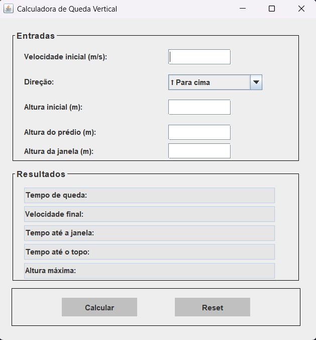

# CalculadoraQuedaVertical

Este projeto consiste em uma aplicação desenvolvida em **Java**, utilizando a biblioteca **Swing** para criação da interface gráfica.

A calculadora tem como objetivo simular e resolver um problema de **queda vertical**, permitindo o cálculo de grandezas como tempo de queda, velocidade e altura em diferentes pontos da trajetória.

---

## 🧪 Exercício base

O sistema foi desenvolvido a partir do seguinte problema de Física:

> Um objeto é lançado verticalmente para baixo com velocidade inicial de 12,0 m/s a partir do telhado de um edifício com 30,0 m de altura em relação ao solo.

A partir disso, a aplicação permite analisar o movimento completo do objeto até o impacto no solo.

---

## ⚙️ Complexidade e expansão do modelo

Inicialmente, o problema considerava apenas um caso simples de lançamento vertical para baixo, com análise apenas do início e do fim do movimento.

Com a evolução do exercício, ele foi expandido para lidar com outros tipos de problemas, como:

- Lançamento para cima ou para baixo
- Análise de pontos intermediários da trajetória
- Cálculo de altura máxima atingida
- 
---

## 🛠️ Tecnologias utilizadas

- **Java**
- **Java Swing (interface gráfica)**

---

## 🖼️ Interface da aplicação

Abaixo está a interface da calculadora em funcionamento:

> 📌 
